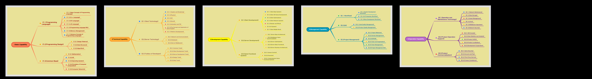

  
  <h1 align="center">Game Development Technology Map</h1>
<!--
  
  

    A quick navigation map for game developers.

  

-->  
  

      
      
      
      
      
  

 
[中文](https://github.com/gonglei007/GameDevMind)

> *❝Our Vision❞*   help game developers save time by sharing knowledge and allow them to invest that saved time into creative work, thereby expanding the technological boundaries of the industry.

 

## Introduction

&emsp;&emsp;We recently organized an open source material library——"Online Game Development Map". The purpose is provide a quick manual for game technical developer to search or view the technology content in his work.
 

    <table style="width:640px;">
        <thead style="font-weight: bold; font-style: italic;">
            <tr>
                <td>&emsp;&emsp;✅ Has &emsp;&emsp;</td>
                <td>&emsp;&emsp;❌ Has not &emsp;&emsp;</td>
            </tr>
        </thead>
        <tbody>
            <tr>
                <td>&emsp;&emsp; ✓ Useful knowledge points. &emsp;&emsp;</td>
                <td>&emsp;&emsp; × <strike>Systematic knowledge explain.</strike> &emsp;&emsp;</td>
            </tr>
            <tr>
                <td>&emsp;&emsp; ✓ Technology application and experience. &emsp;&emsp;</td>
                <td>&emsp;&emsp; × <strike>Specific implementation details.</strike> &emsp;&emsp;</td>
            </tr>
            <tr>
                <td>&emsp;&emsp; ✓ Points or methods to consider. &emsp;&emsp;</td>
                <td>&emsp;&emsp; × <strike>Complete solution.</strike> &emsp;&emsp;</td>
            </tr>
        </tbody>
    </table>

<!--
## Overview

 
-->

 

## Content
> The skills that game developers need to possess in terms of technology include:

  

----

### 1.Basic Capability
<table width="100%" border=1>
    <tr>
        <td width="256" height="192">
            <a href="mds/1.Basic%20Capability/1.Basic%20Capability.md"></img></a>
        </td>
        <td>
            

            As a software product, game development requires certain foundational skills. These capabilities are crucial in software development and form the fundamental skills during the development process. The higher the proficiency in these foundational skills, the more robust and efficient the overall game development process becomes.
            

             
            
<a href="mds/1.Basic%20Capability/1.Basic%20Capability.md">[Read more...]</a>

        </td>
    </tr>
</table>

 

### 2.Technical Capability
<table width="100%" border=1>
    <tr>
        <td width="256" height="192">
            <a href="mds/2.Technical%20Capability/2.Technical%20Capability.md"></img></a>
        </td>
        <td>
            

                Game products also have their specific technical requirements during development. To create a game product, these technical capabilities are necessary.
            

             
            
<a href="mds/2.Technical%20Capability/2.Technical%20Capability.md">[Read more...]</a>

        </td>
    </tr>
</table>

 

### 3.Development Capability
<table width="100%" border=1>
    <tr>
        <td width="256" height="192">
            <a href="mds/3.Development%20Capability/3.Development%20Capability.md"></img></a>
        </td>
        <td>
            

                Games are commodities with artistic elements, constructed from digital content and interactive features. Developing a game product requires a distinct set of technologies, methods, tools, and processes that differentiate it from other software products.
            

             
            
<a href="mds/3.Development%20Capability/3.Development%20Capability.md">[Read more...]</a>

        </td>
    </tr>
</table>

 

### 4.Production Capability
<table width="100%" border=1>
    <tr>
        <td width="256" height="192">
            <a href="mds/4.Production%20Capability/4.Production%20Capability.md"></img></a>
        </td>
        <td>
            

                With the development of the gaming industry, the scale of game product development is becoming larger. At this point, in addition to making the product content enjoyable and developing its core features, it's also crucial to efficiently produce the product. This requires various tools and methods to enhance production efficiency.
            

             
            
<a href="mds/4.Production%20Capability/4.Production%20Capability.md">[Read more...]</a>

        </td>
    </tr>
</table>

 

### 5.Management Capability
<table width="100%" border=1>
    <tr>
        <td width="256" height="192">
            <a href="mds/5.Management%20Capability/5.Management%20Capability.md"></img></a>
        </td>
        <td>
            

                The most challenging aspect of management lies in scale, moderation, and adaptability. One minute less on the fire, and it's undercooked; one minute more, and it's burnt. The pursuit is to simplify complex matters, yet the reality can sometimes turn simple matters into complex ones.
            

             
            
<a href="mds/5.Management%20Capability/5.Management%20Capability.md">[Read more...]</a>

        </td>
    </tr>
</table>

 
        
### 6.Operation Capability
<table width="100%" border=1>
    <tr>
        <td width="256" height="192">
            <a href="mds/6.Operation%20Capability/6.Operation%20Capability.md"></img></a>
        </td>
        <td>
            

                As an organization, regardless of the technology or capabilities you possess, the ultimate goal is to make money. In the current market environment, creating an enjoyable game doesn't necessarily guarantee profitability. A series of operational skills is required to ensure the product's operation, profitability, and the sustained existence of the team. Here, only the technology-related aspects are highlighted.
            

             
            
<a href="mds/6.Operation%20Capability/6.Operation%20Capability.md">[Read more...]</a>

        </td>
    </tr>
</table>

 

## Preview
*[[ Map Overview ]](exports/0.Overview.png)*

 

## Discussions

<!--
## Edit and View
* Use XMind to edit content of folder /xminds/. 
* View quickly in folder /exports/.
* Markdown text content folder（/mds/）。 
-->
## Repo rosters
## Contributors

| [公雷(Initiator)](https://github.com/gonglei007),&emsp; [Game Atom](https://github.com/gameatom),&emsp;  ... |
| :---: |

We sincerely invite more contributors.
 

### Stargazers

 
### Forkers

## Contact us
Email: gonglei007@hotmail.com

